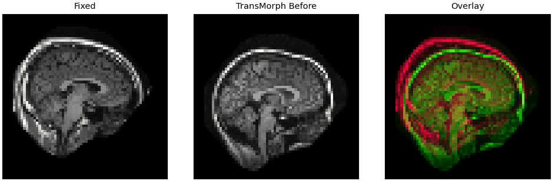
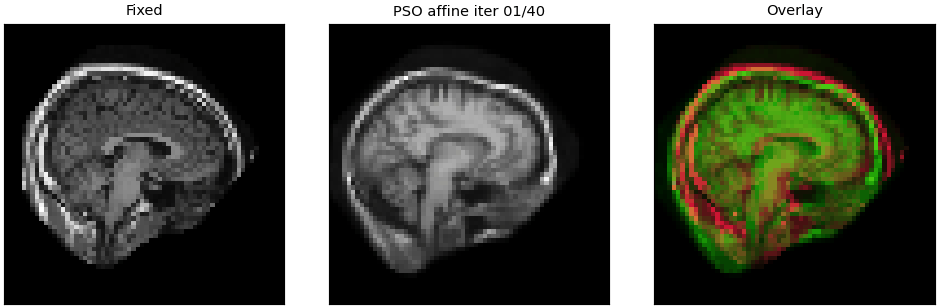

# Fundamental Concepts and Methods in Biomedical Image Registration

> **Group 15 - Computer Vision (IT4343E), Hanoi University of Science and Technology**

<p align="center">
  
</p>

<p align="center">
  <a href="docs/Group_15_Report.pdf"><strong>Project Report</strong></a>
  &nbsp;&bull;&nbsp;
  <a href="docs/Group_15_Presentation.pdf"><strong>Presentation</strong></a>
</p>

This repository studies the foundations of biomedical image registration and compares four representative approaches under one reproducible pipeline: **Diffeomorphic Demons**, **Particle Swarm Optimization (PSO)**, **VoxelMorph**, and **TransMorph**.

| Member | Student ID |
|---|---:|
| Pham Cong Hoang | 202416698 |
| Le Tien Hop | 202400105 |
| Tran Phong Quan | 202416739 |
| Luu Hieu An | 202400093 |

## Contents

1. [Introduction](#1-introduction)
2. [Problem Overview](#2-problem-overview)
3. [Methodology](#3-methodology)
4. [Dataset](#4-dataset)
5. [Experiment](#5-experiment)
6. [Conclusion](#6-conclusion)
7. [Reproduction Guide](#reproduction-guide)

## 1. Introduction

Biomedical image registration aligns two medical images so that corresponding anatomical structures occupy the same spatial coordinates. Given a **fixed image** as the reference and a **moving image** to transform, registration estimates the spatial mapping that best aligns them.

Typical applications include longitudinal disease monitoring, atlas-based segmentation, image-guided intervention, and multimodal fusion of scans such as MRI, CT, and PET.

## 2. Problem Overview

For a fixed image $F$, moving image $M$, and spatial transformation $\phi$, the registered image is $M \circ \phi$. Registration solves an optimization problem of the form:

$$
\phi^* = \arg\min_{\phi \in \mathcal{T}} \; \mathcal{D}(F, M \circ \phi) + \lambda\mathcal{R}(\phi),
$$

where $\mathcal{D}$ measures image dissimilarity and $\mathcal{R}$ encourages a smooth, anatomically plausible transformation. This project reports **mean squared error (MSE)** and **normalized cross-correlation (NCC)** for intensity agreement, **Dice** for anatomical label overlap, runtime, and deformation regularity.

The implementation covers global rigid/affine transformations and dense deformable registration. The learned models are compact, runnable baselines rather than exact reproductions of the full original VoxelMorph and TransMorph training protocols.

## 3. Methodology

| Method | Family | Transformation | Main idea |
|---|---|---|---|
| Diffeomorphic Demons | Classical | Dense deformable | Iteratively estimate, smooth, and compose displacement updates. |
| PSO | Metaheuristic | Rigid/affine | Treat each particle as a candidate transform and search the parameter space using swarm dynamics. |
| VoxelMorph | Deep learning (CNN) | Dense deformable | Predict a displacement field in one forward pass and train without ground-truth deformations. |
| TransMorph | Deep learning (Transformer) | Dense deformable | Use patch-level features and self-attention to capture long-range spatial context. |

The repository also includes synthetic 2D data generation, optional ANTsPyX SyN support, unit tests, smoke tests, benchmark scripts, and visualization utilities.

## 4. Dataset

The main experiment uses **OASIS-1**, a public collection of T1-weighted 3D brain MRI scans from normal and demented subjects. FreeSurfer-derived volumes provide MRI data and anatomical labels.

- 424 adjacent registration pairs
- 297 training pairs, 42 validation pairs, and 85 test pairs
- volumes downsampled to $64 \times 64 \times 64$
- evaluation labels derived from FreeSurfer segmentations

Real OASIS-1 data do not provide dense ground-truth deformation fields. Dice is therefore computed from warped anatomical labels, while MSE and NCC evaluate intensity alignment.

## 5. Experiment

### Experimental Setup

| Component | Configuration |
|---|---|
| CPU | Intel Xeon Gold 6244, 16 cores |
| RAM | 64 GB |
| GPU | NVIDIA Quadro RTX 6000, 24 GB VRAM |
| Software | Python 3.12.13, PyTorch 2.10.0, CUDA 12.6 |
| Evaluation set | 85 OASIS-1 test pairs |

### Quantitative Results

| Method | Runtime (s) ↓ | MSE ↓ | NCC ↑ | Dice ↑ |
|---|---:|---:|---:|---:|
| Classical | 0.512 | 0.0137 ± 0.0081 | 0.732 ± 0.131 | 0.164 ± 0.0369 |
| **PSO affine** | 9.362 | 0.0109 ± 0.0109 | 0.793 ± 0.192 | **0.331 ± 0.2035** |
| **VoxelMorph** | **0.363** | **0.0089 ± 0.0129** | **0.827 ± 0.226** | 0.165 ± 0.0374 |
| TransMorph | 0.385 | 0.0099 ± 0.0119 | 0.807 ± 0.206 | 0.219 ± 0.0917 |

VoxelMorph achieves the best intensity-based performance and fastest mean runtime. PSO obtains the highest anatomical Dice, but is substantially slower. TransMorph provides a balanced learned dense-registration result, while Classical Demons remains a stable, training-free baseline.

### Registration Visualizations

The animations fade between the original moving image and the registered result. In the overlay, closer red/green alignment indicates better agreement with the fixed image.

| Classical Demons | PSO affine |
|---|---|
|  |  |
| **VoxelMorph** | **TransMorph** |
|  |  |

### PSO Optimization Progress

<p align="center">
  
</p>

Additional animations are available for [axial slice sweeps](visualize/oasis3d_benchmark_gifs/02_axial_slice_sweep), [deformation-field scale](visualize/oasis3d_benchmark_gifs/03_final_field_scale), and [anatomical label contours](visualize/oasis3d_benchmark_gifs/04_label_contours).

## 6. Conclusion

- No single method wins every criterion; registration quality is multi-dimensional.
- VoxelMorph is the strongest option here for high-throughput intensity alignment.
- PSO is effective for global anatomical overlap when its longer runtime is acceptable.
- TransMorph offers the most balanced learned dense-registration trade-off in this benchmark.
- Diffeomorphic Demons provides a conservative, training-free dense baseline.

A promising next step is a hybrid pipeline: global affine pre-alignment followed by learned dense refinement. Results should be interpreted within this experiment's limits, including $64^3$ resolution, a pair-level split, compact learned models, and FreeSurfer rather than manually verified landmark labels.

## Reproduction Guide

## Repository Layout

```text
BioMedReg/
  configs/                 Training configs for synthetic, OASIS, and smoke runs
  docs/                    Final report and presentation
  scripts/                 Data preparation, smoke test, and benchmark scripts
  src/
    data/                  Dataset loading and synthetic data helpers
    methods/
      classical/           SimpleITK/ANTs registration wrappers
      metaheuristic/       PSO registration baseline
      voxelmorph/          VoxelMorph-style model, training, and inference
      transmorph/          TransMorph-style model, training, and inference
    utils/                 I/O, metrics, seeding, warping, visualization
    run_method.py          Main CLI for running one registration method
  tests/                   Unit tests
  requirements.txt
  README.md
```

Run commands from the `BioMedReg/` directory unless noted otherwise:

```bash
cd BioMedReg
```

## Environment Setup

Create and activate a virtual environment:

```bash
python -m venv .venv
source .venv/bin/activate
pip install -r requirements.txt
```

If your machine already provides PyTorch, you can reuse system site packages:

```bash
python -m venv --system-site-packages .venv
source .venv/bin/activate
pip install -r requirements.txt
```

Optional: install `antspyx` if you want to use the `ants_syn` classical backend. It is not required for the default smoke tests.

## Quick Reproduction

This path reproduces the project on synthetic data and does not require external datasets.

### 1. Generate Synthetic Data

```bash
python scripts/make_synthetic_data.py \
  --out data/synthetic \
  --num_pairs 20 \
  --size 128 \
  --seed 7
```

Generated files include:

- `fixed_000.nii.gz`
- `moving_000.nii.gz`
- `gt_affine_000.json`
- `gt_displacement_000.npy`
- `preview_000.png`
- `dataset.json`

### 2. Run Classical Registration

```bash
python -m src.run_method \
  --method classical \
  --fixed data/synthetic/fixed_000.nii.gz \
  --moving data/synthetic/moving_000.nii.gz \
  --out outputs/classical
```

Alternative classical backends:

```bash
python -m src.run_method \
  --method classical \
  --backend demons \
  --fixed data/synthetic/fixed_000.nii.gz \
  --moving data/synthetic/moving_000.nii.gz \
  --out outputs/classical_demons
```

```bash
python -m src.run_method \
  --method classical \
  --backend ants_syn \
  --fixed data/synthetic/fixed_000.nii.gz \
  --moving data/synthetic/moving_000.nii.gz \
  --out outputs/classical_ants
```

### 3. Run PSO Registration

```bash
python -m src.run_method \
  --method pso \
  --fixed data/synthetic/fixed_000.nii.gz \
  --moving data/synthetic/moving_000.nii.gz \
  --out outputs/pso \
  --particles 24 \
  --iterations 40 \
  --metric ncc \
  --transform affine
```

### 4. Train and Run VoxelMorph

```bash
python -m src.methods.voxelmorph.train --config configs/voxelmorph.yaml
```

```bash
python -m src.run_method \
  --method voxelmorph \
  --fixed data/synthetic/fixed_000.nii.gz \
  --moving data/synthetic/moving_000.nii.gz \
  --checkpoint outputs/voxelmorph/best.pt \
  --out outputs/voxelmorph_infer
```

### 5. Train and Run TransMorph

```bash
python -m src.methods.transmorph.train --config configs/transmorph.yaml
```

```bash
python -m src.run_method \
  --method transmorph \
  --fixed data/synthetic/fixed_000.nii.gz \
  --moving data/synthetic/moving_000.nii.gz \
  --checkpoint outputs/transmorph/best.pt \
  --out outputs/transmorph_infer
```

## Smoke Tests

Run the complete synthetic smoke test:

```bash
bash scripts/run_all_smoke_tests.sh
```

Expected final line:

```text
ALL 4 METHODS SMOKE TEST PASSED
```

This script generates a small synthetic dataset, runs all four methods, and checks that each method writes the expected outputs.

## Outputs

Most method runs write the following files under the selected output directory:

- `registered.nii.gz`: warped moving image
- `overlay.png`: fixed/moving/registered visual comparison
- `metrics.json`: before/after similarity metrics
- `log.json`: run metadata and output paths
- `deformation_field.npy` and `deformation_field.nii.gz`: dense field for classical and learned methods
- `transform_params.json`: transform parameters for PSO

The main reported metrics are mean squared error (MSE) and normalized cross-correlation (NCC), measured before and after registration.

## OASIS-1 FreeSurfer Reproduction

The synthetic path above is enough to verify the repository. For 3D experiments, this repo also supports OASIS-1 FreeSurfer subject archives. These archives contain MRI volumes and labels such as `T1.mgz`, `aseg.mgz`, and `aparc+aseg.mgz`.

### 1. Download and Extract FreeSurfer Data

```bash
python scripts/download_freesurfer_discs.py --disc 1-11
```

By default, the extraction keeps only the files needed by this project:

- `mri/T1.mgz`
- `mri/norm.mgz`
- `mri/brain.mgz`
- `mri/brainmask.mgz`
- `mri/aseg.mgz`
- `mri/aparc+aseg.mgz`
- `label/*.label`

Extracted subjects are written to:

```text
data/oasis/freesurfer/subjects/
```

### 2. Prepare Small 3D Registration Pairs

```bash
python scripts/prepare_freesurfer_3d.py \
  --subjects-root data/oasis/freesurfer/subjects \
  --out data/oasis/freesurfer_3d_smoke \
  --num_pairs 3 \
  --size 32
```

Prepared pairs include:

- `fixed_000.nii.gz`
- `moving_000.nii.gz`
- `fixed_label_000.nii.gz`
- `moving_label_000.nii.gz`
- `preview_000.png`
- `pair_000.json`
- `dataset.json`

Real OASIS-1 FreeSurfer data provide anatomical labels but not dense ground-truth deformation fields. The prepared dataset stores subject metadata instead of synthetic ground-truth transforms.

### 3. Run the FreeSurfer Smoke Test

```bash
bash scripts/run_freesurfer_smoke_tests.sh
```

Expected final line:

```text
ALL 4 FREESURFER METHODS SMOKE TEST PASSED
```

The script expects either extracted Disc 1 subjects at `data/oasis/freesurfer/subjects/disc1` or an archive at `data/oasis/freesurfer/raw/oasis_cs_freesurfer_disc1.tar.gz`.

## Benchmarking

Run a small functional benchmark over prepared NIfTI pairs:

```bash
python scripts/run_benchmark.py \
  --dataset-root data/oasis/freesurfer_3d_smoke \
  --out outputs/benchmark/freesurfer_smoke
```

Limit the number of pairs:

```bash
python scripts/run_benchmark.py \
  --dataset-root data/oasis/freesurfer_3d_smoke \
  --out outputs/benchmark/freesurfer_smoke \
  --num-pairs 2
```

Use existing checkpoints instead of retraining learned methods:

```bash
python scripts/run_benchmark.py \
  --dataset-root data/oasis/freesurfer_3d_smoke \
  --out outputs/benchmark/freesurfer_smoke \
  --skip-training \
  --voxelmorph-checkpoint outputs/freesurfer_smoke/voxelmorph_train/best.pt \
  --transmorph-checkpoint outputs/freesurfer_smoke/transmorph_train/best.pt
```

Benchmark outputs:

- `benchmark_results.csv`
- `benchmark_results.json`
- `benchmark_summary.json`
- `benchmark_summary.md`
- per-method run folders under `runs/`

The benchmark is intended to check pipeline functionality and produce initial timing/similarity numbers. It is not a final scientific evaluation protocol.

## Testing

Run unit tests:

```bash
python -m pytest -q
```

Run smoke tests:

```bash
bash scripts/run_all_smoke_tests.sh
```

## Configuration

Training configs live in `configs/`.

Useful starting points:

- `configs/voxelmorph.yaml`: synthetic VoxelMorph training
- `configs/transmorph.yaml`: synthetic TransMorph training
- `configs/voxelmorph_smoke.yaml`: tiny synthetic smoke config
- `configs/transmorph_smoke.yaml`: tiny synthetic smoke config
- `configs/voxelmorph_freesurfer_smoke.yaml`: tiny 3D FreeSurfer smoke config
- `configs/transmorph_freesurfer_smoke.yaml`: tiny 3D FreeSurfer smoke config

Edit `data.root`, `output_dir`, model size, epoch count, batch size, and device settings as needed.

## Notes

- External datasets are not required for the synthetic reproduction path.
- Outputs are written under `outputs/` by default.
- Dataset files are expected under `data/` by default.
- Commands using `python -m src...` should be run from the repository root directory `BioMedReg/`.
- The optional `ants_syn` backend requires `antspyx`; default classical runs use SimpleITK.
