# Fundamental Concepts and Methods in Biomedical Image Registration

> Group 15 - Computer Vision (IT4343E), Hanoi University of Science and Technology

This project explains the core ideas behind biomedical image registration and compares four representative methods in one reproducible pipeline: **Diffeomorphic Demons**, **Particle Swarm Optimization (PSO)**, **VoxelMorph**, and **TransMorph**.

<p align="center">
  <a href="docs/Group_15_Report.pdf"><strong>Read the report</strong></a>
  &nbsp;&bull;&nbsp;
  <a href="docs/Group_15_Presentation.pdf"><strong>View the presentation</strong></a>
  &nbsp;&bull;&nbsp;
  <a href="#reproduce-the-project"><strong>Reproduce the project</strong></a>
</p>

## Animated Registration Comparison

The animations fade from each original moving image to its registered result. In the overlays, closer agreement between the red and green structures indicates better alignment with the fixed image.

| Classical Demons | PSO affine |
|---|---|
|  |  |
| **VoxelMorph** | **TransMorph** |
|  |  |

## Team

| Member | Student ID | Main contribution |
|---|---:|---|
| Pham Cong Hoang | 202416698 | Project lead, slides, report, visualizations, VoxelMorph |
| Le Tien Hop | 202400105 | Data preprocessing, classical methods, report |
| Tran Phong Quan | 202416739 | TransMorph, report, literature survey |
| Luu Hieu An | 202400093 | PSO, visualizations |

## At a Glance

| Item | Description |
|---|---|
| Task | Align a moving medical image with a fixed reference image |
| Main dataset | OASIS-1 T1-weighted 3D brain MRI with FreeSurfer labels |
| Compared methods | Diffeomorphic Demons, PSO affine, VoxelMorph, TransMorph |
| Evaluation | MSE, NCC, Dice, runtime, and deformation regularity |
| Reproducibility | Synthetic smoke tests and a full OASIS-1 3D benchmark pipeline |

## Contents

- [1. Introduction](#1-introduction)
- [2. Problem Overview](#2-problem-overview)
- [3. Methodology](#3-methodology)
- [4. Dataset](#4-dataset)
- [5. Experiment and Results](#5-experiment-and-results)
- [6. Conclusion](#6-conclusion)
- [Reproduce the Project](#reproduce-the-project)
- [Repository Structure](#repository-structure)
- [Project Documents](#project-documents)

## 1. Introduction

Biomedical image registration aligns two medical images so that the same anatomical structures correspond spatially.

- The **fixed image** is the reference.
- The **moving image** is transformed.
- The **registered image** is the warped moving image after alignment.

Registration supports longitudinal disease monitoring, atlas-based segmentation, image-guided intervention, and multimodal fusion of scans such as MRI, CT, and PET.

This project has three goals:

1. explain the mathematical foundations of image registration;
2. implement classical, metaheuristic, CNN-based, and Transformer-based methods; and
3. compare their accuracy, speed, and deformation behavior on the same data.

## 2. Problem Overview

Given a fixed image $F$, a moving image $M$, and a spatial transformation $\phi$, the registered image is $M \circ \phi$. Registration estimates the transformation that minimizes:

$$
\phi^* = \arg\min_{\phi \in \mathcal{T}}
\left[\mathcal{D}(F, M \circ \phi) + \lambda\mathcal{R}(\phi)\right].
$$

| Term | Purpose |
|---|---|
| $\mathcal{D}(F, M \circ \phi)$ | Measures how different the fixed and registered images are |
| $\mathcal{R}(\phi)$ | Penalizes irregular or anatomically implausible transformations |
| $\lambda$ | Balances image matching and transformation regularity |
| $\mathcal{T}$ | Defines the allowed transformation family |

The project covers two broad transformation types:

- **Rigid/affine registration** corrects global rotation, translation, scale, and shear.
- **Dense deformable registration** predicts local displacement at every voxel.

MSE and NCC measure intensity agreement, Dice measures anatomical label overlap, runtime measures computational cost, and the Jacobian determinant is used to inspect deformation regularity.

## 3. Methodology

| Method | Family | Transformation | Core idea | Main trade-off |
|---|---|---|---|---|
| Diffeomorphic Demons | Classical | Dense deformable | Repeatedly estimate, smooth, and compose displacement updates | Stable and training-free, but conservatively configured |
| PSO | Metaheuristic | Rigid/affine | Search the affine parameter space with a swarm of candidate transforms | Strong global alignment, but slow |
| VoxelMorph | CNN | Dense deformable | Predict a displacement field in one forward pass using unsupervised image similarity | Fast and strong on intensity metrics |
| TransMorph | Transformer | Dense deformable | Use patch features and self-attention to capture long-range context | Balanced overlap, speed, and regularity |

The VoxelMorph-style and TransMorph-style networks in this repository are intentionally compact. They preserve the central ideas of the original methods, but are not exact reproductions of the full published architectures or training protocols.

## 4. Dataset

### Main Experiment: OASIS-1

The final benchmark uses OASIS-1, a public dataset of T1-weighted 3D brain MRI scans from normal and demented subjects. FreeSurfer-derived volumes provide MRI data and anatomical segmentation labels.

| Split | Adjacent pairs | Purpose |
|---|---:|---|
| Training | 297 | Train VoxelMorph and TransMorph |
| Validation | 42 | Run held-out checks for the learned methods |
| Test | 85 | Compare all four methods |
| **Total** | **424** | Pair-level experimental dataset |

All volumes are downsampled to $64 \times 64 \times 64$. OASIS-1 does not provide dense ground-truth deformation fields, so Dice is computed from warped FreeSurfer labels while MSE and NCC evaluate intensity alignment.

### Synthetic Data

The repository can also generate small 2D image pairs with known transformations. This path requires no external dataset and is intended for quick functional checks, development, and smoke testing.

## 5. Experiment and Results

### Experimental Setup

| Component | Configuration |
|---|---|
| CPU | Intel Xeon Gold 6244, 16 cores |
| RAM | 64 GB |
| GPU | NVIDIA Quadro RTX 6000, 24 GB VRAM |
| Software | Python 3.12.13, PyTorch 2.10.0, CUDA 12.6 |
| Evaluation set | 85 OASIS-1 test pairs |

### Quantitative Results

Arrows indicate the preferred direction for each metric. Values are reported as mean or mean ± standard deviation across the test set.

| Method | Runtime (s) ↓ | MSE ↓ | NCC ↑ | Dice ↑ |
|---|---:|---:|---:|---:|
| Classical | 0.512 | 0.0137 ± 0.0081 | 0.732 ± 0.131 | 0.164 ± 0.0369 |
| PSO affine | 9.362 | 0.0109 ± 0.0109 | 0.793 ± 0.192 | **0.331 ± 0.2035** |
| VoxelMorph | **0.363** | **0.0089 ± 0.0129** | **0.827 ± 0.226** | 0.165 ± 0.0374 |
| TransMorph | 0.385 | 0.0099 ± 0.0119 | 0.807 ± 0.206 | 0.219 ± 0.0917 |

### How to Read the Results

- **Best intensity alignment:** VoxelMorph obtains the lowest MSE and highest NCC.
- **Best anatomical overlap:** PSO affine obtains the highest Dice, but has the longest runtime.
- **Balanced learned method:** TransMorph improves Dice and deformation regularity relative to the compact VoxelMorph model while remaining fast.
- **Stable training-free baseline:** Diffeomorphic Demons requires no learned weights and produced the most conservative dense deformation field in this experiment.

No method wins every metric. The best choice depends on whether the downstream task prioritizes intensity matching, anatomical overlap, speed, or deformation regularity.

### Result Dashboard

The following charts provide complementary views of the 85-pair test set. The summary chart shows the means reported in the table, while the distributions expose pair-to-pair variation.

<p align="center">
  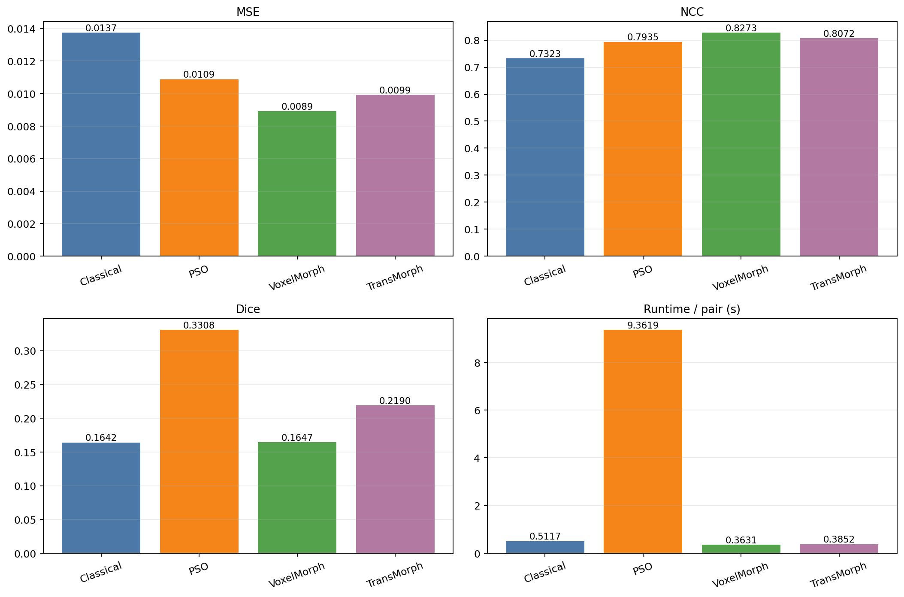
</p>

<p align="center">
  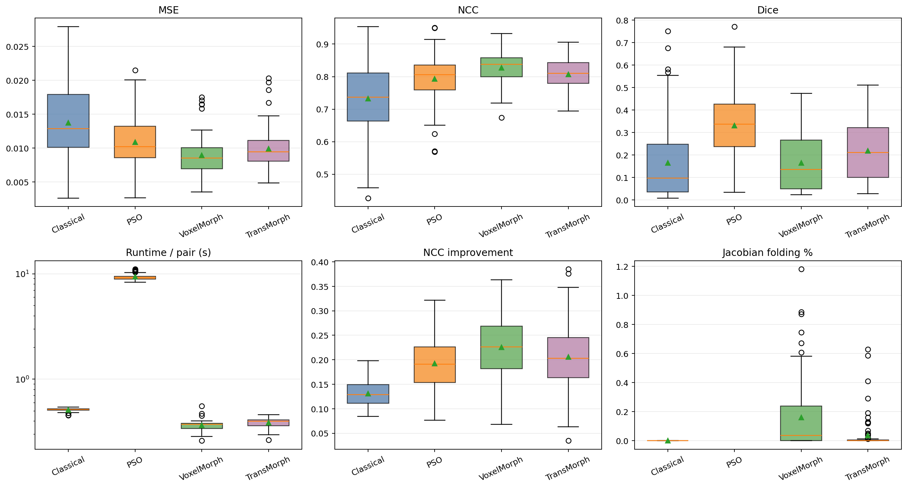
</p>

VoxelMorph wins NCC on 54 of 85 test pairs, while PSO wins Dice on 55 pairs. The winner counts show that the mean results are supported across many test cases rather than by only a few outliers.

<p align="center">
  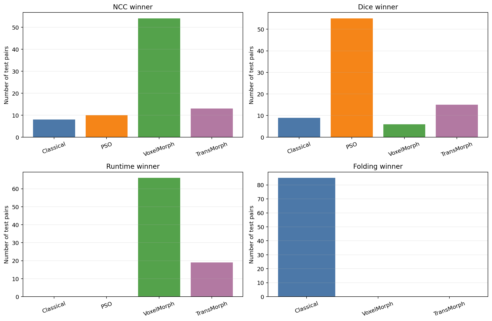
</p>

The plots below highlight two important trade-offs: runtime versus mean quality, and the fact that high intensity agreement does not always imply high anatomical overlap.

| Runtime-quality trade-off | Pair-level NCC versus Dice |
|---|---|
| 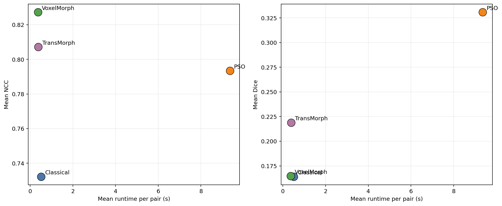 | 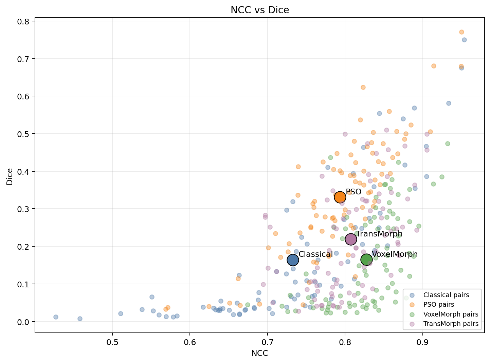 |

### Learned-Model Training and Anatomical Results

VoxelMorph and TransMorph were trained for 20 epochs. The training curves separate total loss, image-similarity loss, and deformation smoothness loss.

<p align="center">
  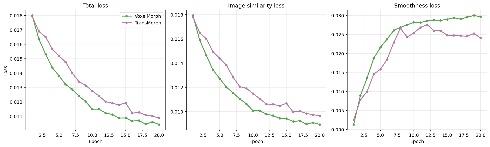
</p>

Dice also varies substantially by anatomical structure. Large regions such as cerebral white matter are generally easier to align than small subcortical structures at $64^3$ resolution.

<p align="center">
  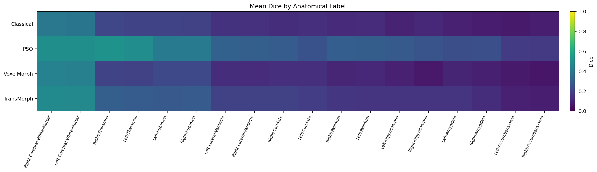
</p>

<details>
<summary><strong>Show a full qualitative comparison for test pair 073</strong></summary>

<p align="center">
  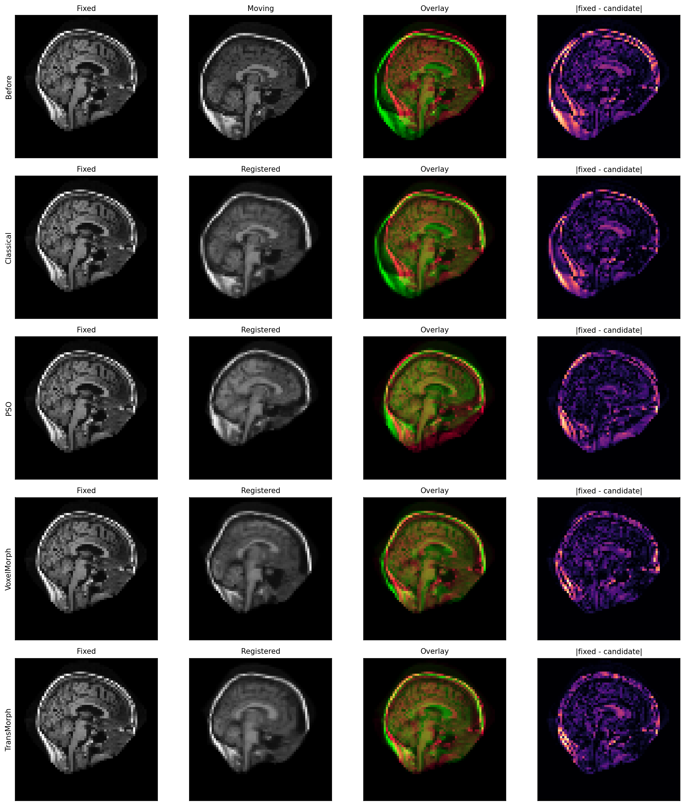
</p>

</details>

### PSO Optimization Progress

This animation shows how the best affine candidate changes over the PSO iterations.

<p align="center">
  
</p>

### More 3D Visualizations

<details>
<summary><strong>Axial slice sweeps</strong></summary>

| Classical Demons | PSO affine |
|---|---|
|  | 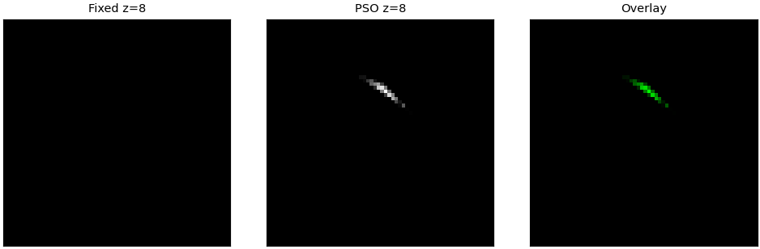 |
| **VoxelMorph** | **TransMorph** |
| 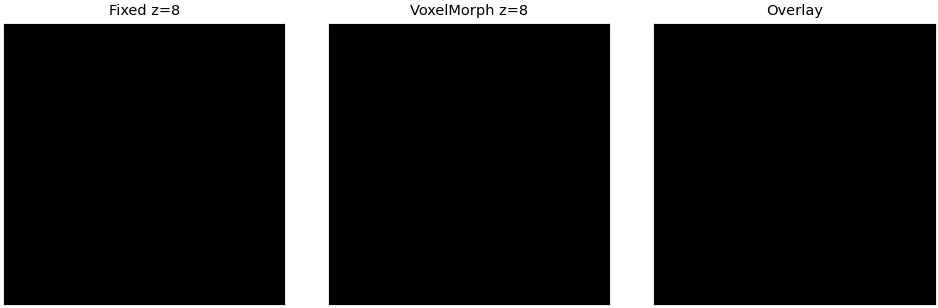 |  |

</details>

<details>
<summary><strong>Anatomical label contours</strong></summary>

| Classical Demons | PSO affine |
|---|---|
| 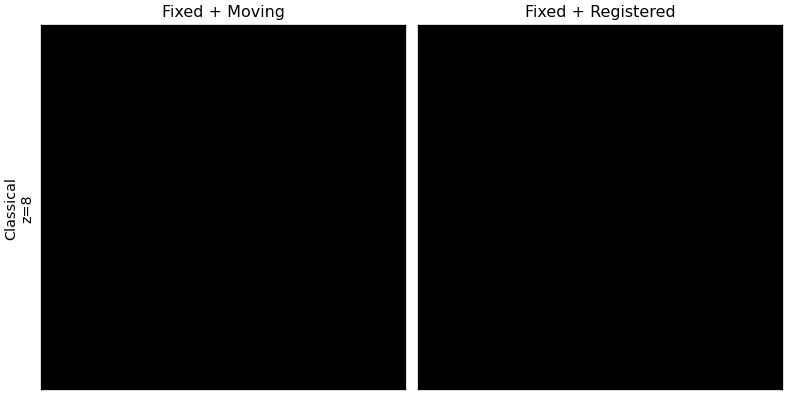 | 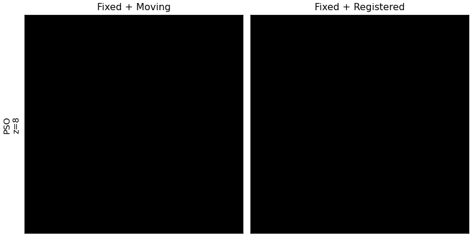 |
| **VoxelMorph** | **TransMorph** |
| 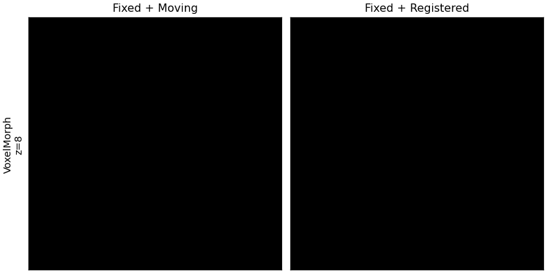 |  |

</details>

<details>
<summary><strong>Dense deformation-field scale</strong></summary>

PSO is omitted because it estimates a global affine transform rather than a dense displacement field.

| Classical Demons | VoxelMorph | TransMorph |
|---|---|---|
| 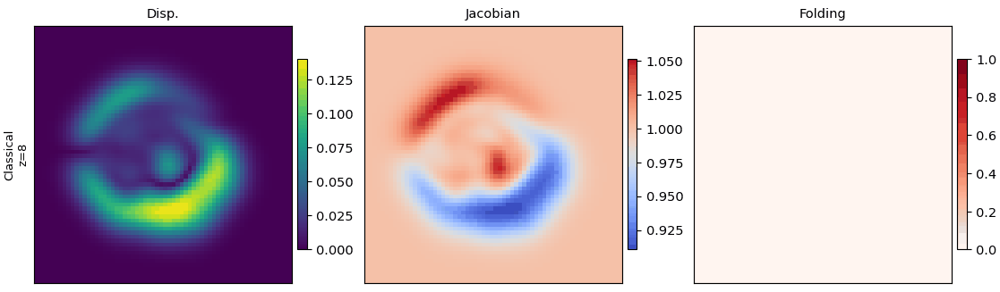 | 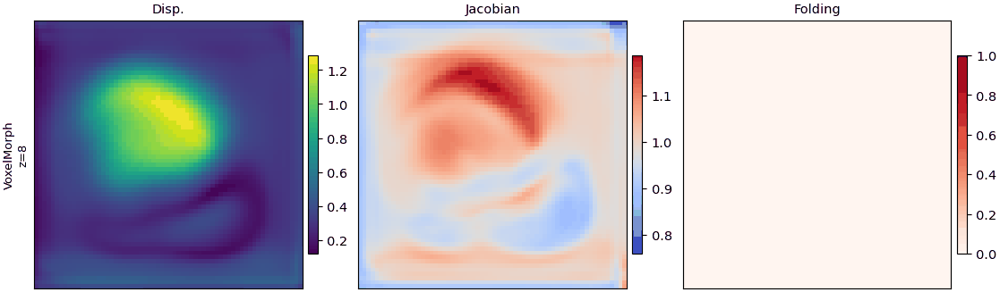 | 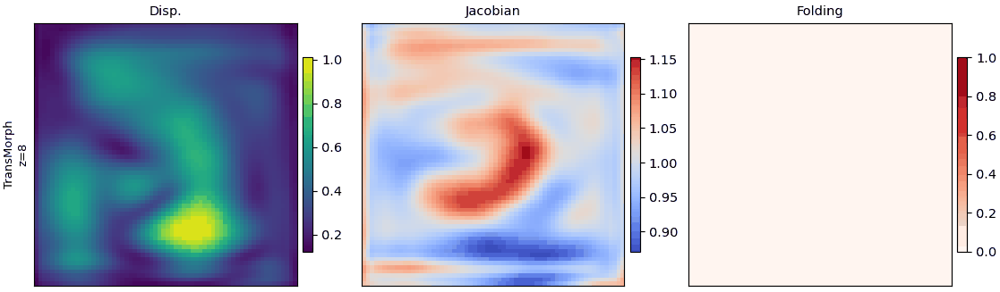 |

</details>

Direct links to each animation collection:

- [moving-to-registered comparisons for all methods](visualize/oasis3d_benchmark_gifs/01_moving_to_registered_fade)
- [3D axial slice sweeps](visualize/oasis3d_benchmark_gifs/02_axial_slice_sweep)
- [deformation-field scale](visualize/oasis3d_benchmark_gifs/03_final_field_scale)
- [anatomical label contours](visualize/oasis3d_benchmark_gifs/04_label_contours)
- [PSO iteration progress](visualize/oasis3d_benchmark_gifs/05_true_iterations)

## 6. Conclusion

The benchmark shows that biomedical image registration is a multi-objective problem:

- choose **VoxelMorph** for fast, high-throughput intensity alignment;
- choose **PSO affine** when global anatomical overlap is the priority and longer runtime is acceptable;
- choose **TransMorph** for a balanced learned dense-registration baseline; and
- choose **Diffeomorphic Demons** for a stable, reproducible, training-free dense baseline.

A promising next step is a hybrid pipeline that performs global affine pre-alignment before learned dense refinement.

These conclusions are limited to the implementations and protocol in this repository. Important limitations include $64^3$ resolution, a pair-level rather than subject-level split, compact learned models, limited training and tuning, and FreeSurfer-derived labels instead of manually verified landmarks.

## Reproduce the Project

Run all commands from the repository root.

### 1. Set Up the Environment

```bash
git clone https://github.com/kongwoang/Biomedical_Image_Registration.git
cd Biomedical_Image_Registration

python -m venv .venv
source .venv/bin/activate
pip install -r requirements.txt
```

If PyTorch is already installed globally, the virtual environment can reuse it:

```bash
python -m venv --system-site-packages .venv
source .venv/bin/activate
pip install -r requirements.txt
```

`antspyx` is optional and is required only for the `ants_syn` classical backend.

### 2. Run the Fast Synthetic Smoke Test

This is the shortest end-to-end check. It generates synthetic data, runs all four methods, and verifies their output files.

```bash
bash scripts/run_all_smoke_tests.sh
```

Successful completion ends with:

```text
ALL 4 METHODS SMOKE TEST PASSED
```

### 3. Run Individual Methods

First generate a larger synthetic sample:

```bash
python scripts/make_synthetic_data.py \
  --out data/synthetic \
  --num_pairs 20 \
  --size 128 \
  --seed 7
```

<details>
<summary><strong>Classical registration</strong></summary>

```bash
python -m src.run_method \
  --method classical \
  --fixed data/synthetic/fixed_000.nii.gz \
  --moving data/synthetic/moving_000.nii.gz \
  --out outputs/classical
```

Use `--backend demons` for standard Demons or `--backend ants_syn` for the optional ANTsPyX SyN backend.

</details>

<details>
<summary><strong>PSO affine registration</strong></summary>

```bash
python -m src.run_method \
  --method pso \
  --fixed data/synthetic/fixed_000.nii.gz \
  --moving data/synthetic/moving_000.nii.gz \
  --out outputs/pso \
  --particles 24 \
  --iterations 40 \
  --metric ncc \
  --transform affine
```

</details>

<details>
<summary><strong>VoxelMorph training and inference</strong></summary>

```bash
python -m src.methods.voxelmorph.train --config configs/voxelmorph.yaml

python -m src.run_method \
  --method voxelmorph \
  --fixed data/synthetic/fixed_000.nii.gz \
  --moving data/synthetic/moving_000.nii.gz \
  --checkpoint outputs/voxelmorph/best.pt \
  --out outputs/voxelmorph_infer
```

</details>

<details>
<summary><strong>TransMorph training and inference</strong></summary>

```bash
python -m src.methods.transmorph.train --config configs/transmorph.yaml

python -m src.run_method \
  --method transmorph \
  --fixed data/synthetic/fixed_000.nii.gz \
  --moving data/synthetic/moving_000.nii.gz \
  --checkpoint outputs/transmorph/best.pt \
  --out outputs/transmorph_infer
```

</details>

### 4. Run the OASIS-1 FreeSurfer Pipeline

Download and extract the FreeSurfer subject archives:

```bash
python scripts/download_freesurfer_discs.py --disc 1-11
```

The downloader retains only the MRI volumes, anatomical labels, and metadata needed by the project. Extracted subjects are written under `data/oasis/freesurfer/subjects/`.

For a small 3D functional check, prepare three pairs and run the FreeSurfer smoke test:

```bash
python scripts/prepare_freesurfer_3d.py \
  --subjects-root data/oasis/freesurfer/subjects \
  --out data/oasis/freesurfer_3d_smoke \
  --num_pairs 3 \
  --size 32

bash scripts/run_freesurfer_smoke_tests.sh
```

For the split-aware 3D benchmark used by the project, run:

```bash
CUDA_VISIBLE_DEVICES=0 \
VOXELMORPH_DEVICE=cuda:0 \
TRANSMORPH_DEVICE=cuda:0 \
SIZE=64 \
DEEP_EPOCHS=20 \
PSO_PARTICLES=16 \
PSO_ITERS=30 \
PSO_TRANSFORM=affine \
bash scripts/run_oasis1_3d_functional_benchmark.sh
```

This full pipeline requires a CUDA-capable environment. `NUM_PAIRS` can be set to limit the run during development.

### 5. Outputs

Most method runs write:

| File | Description |
|---|---|
| `registered.nii.gz` | Warped moving image |
| `overlay.png` | Fixed, moving, and registered visual comparison |
| `metrics.json` | Before/after similarity metrics |
| `log.json` | Run configuration, metadata, and output paths |
| `deformation_field.npy` / `.nii.gz` | Dense field produced by classical and learned methods |
| `transform_params.json` | Rigid/affine parameters produced by PSO |

Benchmark runs additionally produce `benchmark_results.csv`, `benchmark_results.json`, `benchmark_summary.json`, and `benchmark_summary.md`.

### 6. Tests and Configuration

Run the unit tests:

```bash
python -m pytest -q
```

Training configurations live in `configs/`:

- `voxelmorph.yaml` and `transmorph.yaml`: standard synthetic training
- `voxelmorph_smoke.yaml` and `transmorph_smoke.yaml`: small synthetic smoke runs
- `voxelmorph_freesurfer_smoke.yaml` and `transmorph_freesurfer_smoke.yaml`: small 3D FreeSurfer runs

Edit `data.root`, `output_dir`, model size, epoch count, batch size, and device settings as needed.

## Repository Structure

```text
Biomedical_Image_Registration/
├── configs/                 # Training and smoke-test configurations
├── docs/                    # Final report and presentation
├── scripts/                 # Data preparation, benchmark, and visualization scripts
├── src/
│   ├── data/                # Dataset loading and synthetic data generation
│   ├── methods/
│   │   ├── classical/       # SimpleITK and optional ANTs registration
│   │   ├── metaheuristic/   # PSO registration
│   │   ├── voxelmorph/      # CNN model, training, and inference
│   │   └── transmorph/      # Transformer model, training, and inference
│   └── utils/               # Metrics, warping, I/O, and visualization
├── tests/                   # Unit tests
└── visualize/               # Benchmark figures, notebooks, and GIF animations
```

The main command-line entry point for a single registration pair is `python -m src.run_method`.

## Project Documents

- [Final report](docs/Group_15_Report.pdf)
- [Final presentation](docs/Group_15_Presentation.pdf)
